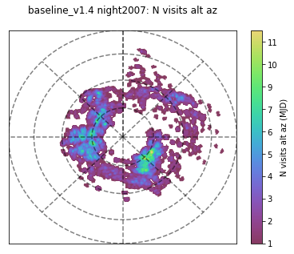
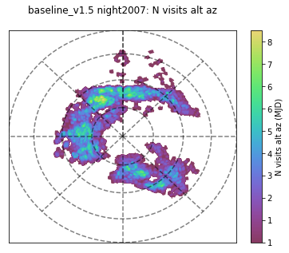

FBS runs 1.5

This release includes 86 simulation databases. Most of the experiments from v1.4 have been replicated.

The major update in this release is that we use a new algorithm when selecing large areas to survey. Before, we simply sorted by reward function. In v1.5, we demand the area be contiguous. This helps keep the slewtime down, increases the amount of sky that has rapid revisits, and does not seem to impact the overall survey uniformity.

 

Additional changes include:

* Eliminating excess filter changes in DDF sequences
* The u filter remains mounted (and z unmounted) until the moon is 40% illuminated
* u-band observations are paired with either g or r. 
* We have removed the DDF 290 and replaced it with the Euclid DDF pointings
* Improved 5-sigma depth calculations for when visits have 2 snaps

git repo with potenitally more notes on the runs: https://github.com/lsst-sims/sims_featureScheduler_runs1.5
The databases are avialable from NCSA at: https://lsst-web.ncsa.illinois.edu/sim-data/sims_featureScheduler_runs1.5/
MAF output will be at:  http://astro-lsst-01.astro.washington.edu:8083

